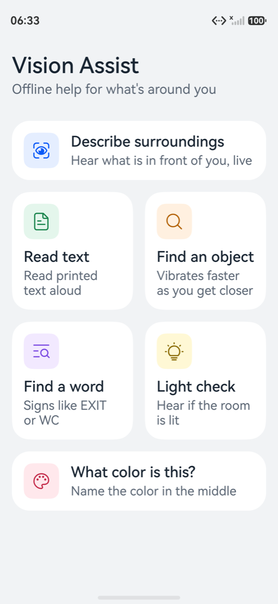
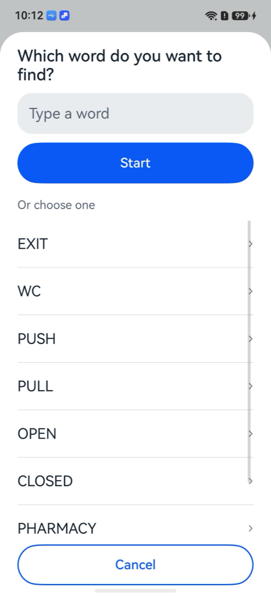
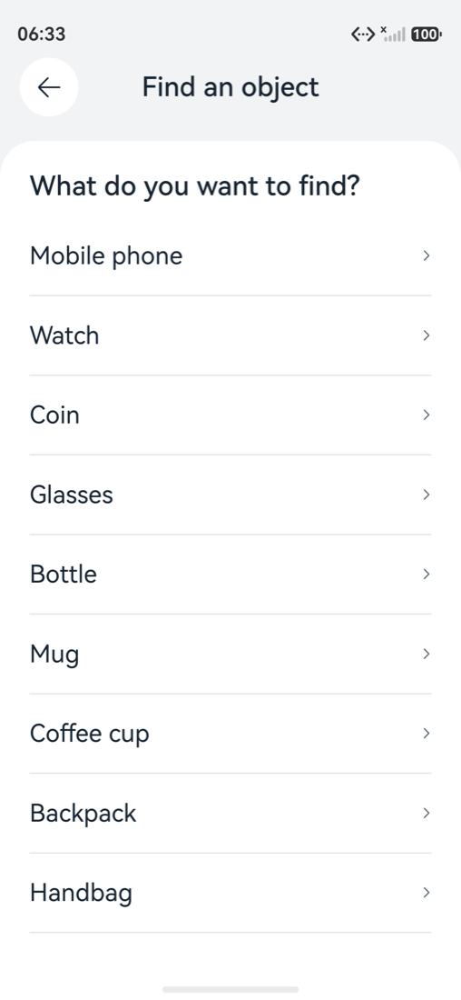

# Vision Assist

An offline assistive feature for blind and low-vision users on HarmonyOS. Point the phone, and it tells you what is in front of you, with boxes drawn on the live camera view. All recognition runs on the device: no cloud, no account, no camera frame leaves the phone.

Built for the HackYeah 2026 Huawei challenge "Imagine What's Next" (Human-Centric Technology, Intelligent Experiences).

## Status

| Feature | State |
|---|---|
| Live describe (camera, on-device detection, boxes, spoken summary) | Working on the emulator |
| Screen reader support | Implemented and checked through the accessibility tree; not yet tried with the screen reader switched on |
| Front and back camera | Switch button on every feature screen; boxes land on the objects with both emulator cameras |
| Find an object with "warmer / colder" vibration | Implemented, runs on the emulator; vibration not verified (the emulator vibrator reports "Device operation failed") |
| Read printed text | Implemented with an on-device OCR fallback (Core Vision OCR does not run on the emulator) |
| Find a word (typed or preset, spoken and haptic guidance) | Implemented; picker, typing and the OCR loop verified on the emulator, guidance on real printed text and vibration not verified |

## Screens

The app opens on a list of features without starting the camera. Each feature has its own screen with the camera view, a status card with the spoken result and one large action button. Find an object and Find a word first ask what to look for in a bottom sheet.

| Start screen | Find an object, back camera | Front camera |
|---|---|---|
|  | _Live detection screenshot coming soon_ | _Front camera screenshot coming soon_ |

| Find a word picker | Find an object picker |
|---|---|
|  |  |

Known limits: the detector knows 194 everyday classes. It is weak on small items such as keys and has no wallet class. See `tools/model/README.md`.

## How it works

```
Camera Kit (preview + ImageReceiver)
        |  RGBA frame, about 4 per second
        v
FrameNormalizer   crop black borders, rotate upright
        |
        v
YoloDetector      letterbox 640x640, MindSpore Lite predict, class-wise NMS
        |
        v
SceneTracker      merge people labels, debounce, build "cup on the left, person ahead"
        |
        +--> Canvas overlay (boxes + labels)
        +--> Narrator: system screen reader announcement if it is on, otherwise Core Speech Kit
```

Source layout (`entry/src/main/ets`):

| Path | Responsibility |
|---|---|
| `pages/Index.ets` | Navigation between the start screen and feature screens |
| `pages/HomePage.ets` | Start screen with the feature tiles |
| `pages/FeaturePage.ets` | Feature screen: camera, status, action button, picker, camera switch |
| `app/AppServices.ets` | Camera, detector, text reader and narrator shared by all screens |
| `ui/FeatureCatalog.ets` | Names, descriptions, icons, colours and labels of each feature |
| `ui/components/*.ets` | Tile, top bar, buttons, status card, camera preview, picker sheet |
| `ui/theme/Theme.ets` | All colours, sizes, spacing and font sizes |
| `ui/Overlay.ets` | Boxes and labels drawn over the camera view, mirrored for the front camera |
| `camera/CameraSource.ets` | Camera session, front and back switching, frame delivery with throttling |
| `vision/FrameNormalizer.ets` | Frame cleanup and mapping to the preview |
| `vision/YoloDetector.ets` | Model loading, preprocessing, decoding, NMS |
| `vision/SceneTracker.ets` | Which objects to announce and when |
| `features/*.ets` | One class per feature; `GuidanceCoach` is the shared pulse and speech logic of both find modes |
| `vision/text/*.ets` | OCR engines, word boxes and `WordMatcher` |
| `speech/Narrator.ets` | Text to speech and accessibility announcements |

Accessibility:

- Every tile, button and picker row is one screen reader item with a name and a description; the icon, title and description of a tile are grouped, so a tile reads as "Describe surroundings, button, Hear what is in front of you, live".
- Icons, the camera view and the overlay are hidden from the screen reader. Focus goes top to bottom: back, title, camera switch, status, action button.
- Opening a feature announces its name; results are announced with `announceForAccessibility` when a screen reader is on, otherwise spoken with Core Speech Kit.
- Touch targets are at least 48 vp (tiles and picker rows are larger, the action button is at least 56 vp high). Text is in fp and cards grow with the text; from a font scale of 1.6 the start screen switches to one column.
- Secondary text is `#5A6573` (5.3:1 on the page background) and the feature colours are darkened where needed to keep at least 4.1:1 against their tinted chips.

Camera: the switch button in the top bar changes between the back and the front camera. Each camera has its own frame rotation (`BACK_FRAME_ROTATION`, `FRONT_FRAME_ROTATION` in `common/Config.ets`), and the overlay is mirrored for the front camera because its preview is mirrored.

Platform capabilities used: Camera Kit, MindSpore Lite Kit (on-device inference), Core Speech Kit (offline TTS), Accessibility Kit.

## How word matching works

"Find a word" runs the text reader (system OCR first, on-device PaddleOCR when the system one is unavailable) about every 700 ms and never overlaps two runs. Each detected text box comes back with its text and a normalised box. `vision/text/WordMatcher.ets` then looks for the target:

- Case and punctuation are ignored; a box with several words is split into words.
- A target of 4 or more letters matches a word that differs by at most one inserted, missing or wrong letter, or that contains the target (or is contained in it, for words of 4 or more letters). Shorter targets such as WC must match exactly.
- A target of several words matches only consecutive words in reading order; the highlighted box is the union of their boxes.
- The best-scoring match wins: exact, then one-letter difference, then substring.

The match box feeds the same guidance as "Find an object" (`features/GuidanceCoach.ets`): pulse rate from how central and large the box is, "Warmer / Colder, turn left", and "right in front of you". The last guidance is kept for 1.5 s so the vibration continues between OCR runs. Without a match it says "Searching for X, move the phone slowly" at most every 3 s. Known limits: OCR confuses similar glyphs (0 and O are not unified) and the on-device OCR cuts by detected box, so a word inside a long box highlights the whole box.

Unit tests for the pure logic live in `entry/src/test`. Run them with:

```sh
export DEVECO_SDK_HOME=/Applications/DevEco-Studio.app/Contents/sdk NODE_HOME=/Applications/DevEco-Studio.app/Contents/tools/node
/Applications/DevEco-Studio.app/Contents/tools/hvigor/bin/hvigorw test --no-daemon
```

hvigor prints nothing on success; the per-test result is in `entry/.test/default/intermediates/test/coverage_data/test_result.txt`.

## Requirements

- DevEco Studio 6.1.1 or later (macOS arm64 or Windows). The project targets HarmonyOS API 24 (`6.1.1(24)`) and declares API 20 (`6.0.0(20)`) as the minimum.
- A HarmonyOS emulator (Huawei phone image, API 24) or a physical HarmonyOS device. The emulator image needs the DevEco region set to China; see `docs/EMULATOR.md`.

## Build and run

1. Open this folder in DevEco Studio.
2. Create signing material: File, Project Structure, Signing Configs, "Automatically generate signature" (needs a Huawei ID), or use the repository's offline path below.
3. Start an emulator from DevEco Studio's Device Manager (not from the command line, see `docs/EMULATOR.md`).
4. Run the `entry` module, choose a feature and allow camera access when asked.

Installing on a physical phone (signing, USB debugging, things to check): see `docs/DEVICE.md`.

Command line (with `devecocli`):

```sh
devecocli build
devecocli run --device 127.0.0.1:5555
```

Offline signing for the emulator (no account) with the sample keys that ship in the OpenHarmony SDK:

```sh
SDK=/Applications/DevEco-Studio.app/Contents/sdk/default/openharmony/toolchains/lib
mkdir -p signatures && cp "$SDK/OpenHarmony.p12" "$SDK/OpenHarmonyProfileRelease.pem" signatures/
```

Create a profile for the bundle `com.hackyeah.visionassist` from `$SDK/UnsgnedReleasedProfileTemplate.json` (change `bundle-name`) and sign it with `hap-sign-tool.jar sign-profile` (sample key password is documented by OpenHarmony). Then add a `signingConfigs` entry to `build-profile.json5` pointing at the files in `signatures/`. The `signatures/` folder is git-ignored on purpose.

## Model

`entry/src/main/resources/rawfile/yolov8s_oiv7_640_sub.ms` is committed so the app builds without any model tooling. To rebuild it, follow `tools/model/README.md`.

## License

Application code: MIT. The bundled model is AGPL-3.0, see `NOTICE.md`.
